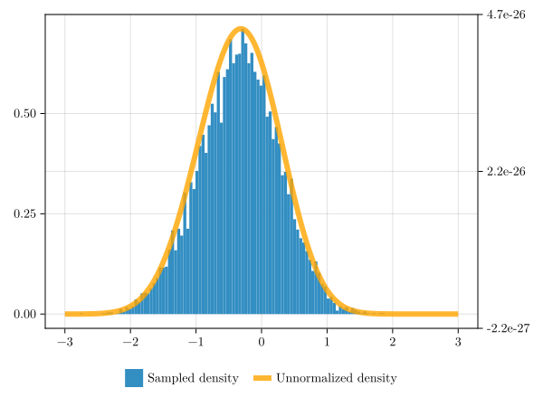

# ARSampling

[](https://Eliassj.github.io/ARSampling.jl/stable)
[](https://Eliassj.github.io/ARSampling.jl/dev)
[](https://github.com/Eliassj/ARSampling.jl/actions/workflows/Test.yml?query=branch%3Amaster)
[](https://codecov.io/gh/Eliassj/ARSampling.jl)
[](https://github.com/Eliassj/ARSampling.jl/actions/workflows/Lint.yml?query=branch%3Amaster)
[](https://github.com/Eliassj/ARSampling.jl/actions/workflows/Docs.yml?query=branch%3Amaster)
[](https://github.com/JuliaBesties/BestieTemplate.jl)

## Example

``` julia
using ARSampling: ARSampler, Objective, sample!
using CairoMakie, Random, SpecialFunctions
set_theme!(theme_latexfonts()) 
update_theme!(linewidth = 6)
Random.seed!(1)

k, n = 3, 25

function log_alpha(x, k, n)
           alpha = exp(x)
           x +
           x * (k - 3 / 2) +
           (-1 / (2 * alpha)) +
           loggamma(alpha) -
           loggamma(n + alpha)
end

obj = Objective(x -> log_alpha(x, k, n))

sam = ARSampler(obj, (-Inf, Inf))
samples = sample!(sam, 10000)

fig, ax, hst = hist(
    samples, 
    bins=100, 
    normalization = :pdf, 
    axis = (; xticks = -3:3)
);
ax2 = Axis(fig[1,1], yaxisposition = :right, ytickformat = "{:.1e}")
hidespines!(ax2)
hidexdecorations!(ax2)
linkxaxes!(ax, ax2)

lins = lines!(
    ax2, 
    -3..3,
    x -> exp(log_alpha(x, k, n)), 
    color = :orange, 
    alpha = 0.8
)
Legend(fig[2, 1], [hst, lins], ["Sampled density", "Unnormalized density"], 
    orientation = :horizontal, framevisible = false)
fig
```



## How to Cite

If you use ARSampling.jl in your work, please cite using the reference given in [CITATION.cff](https://github.com/Eliassj/ARSampling.jl/blob/master/CITATION.cff).
